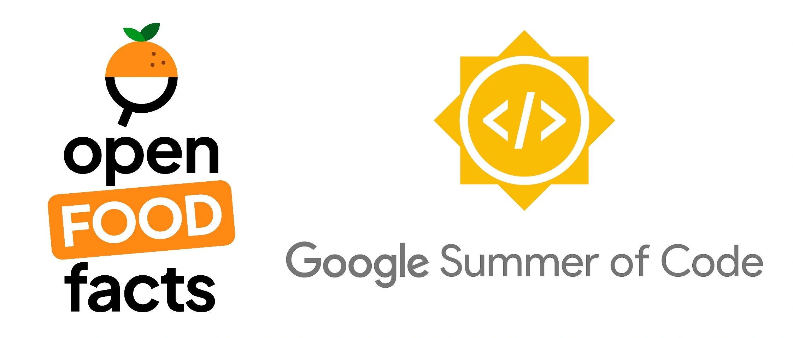
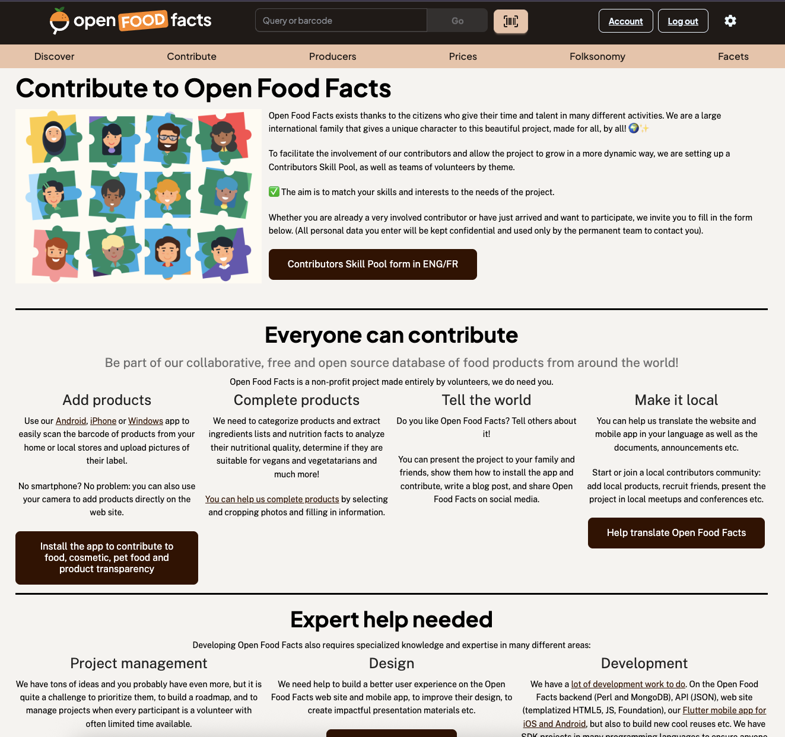
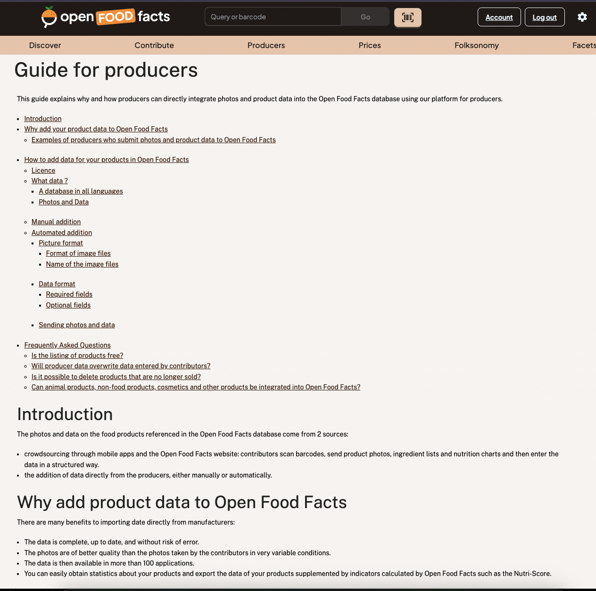
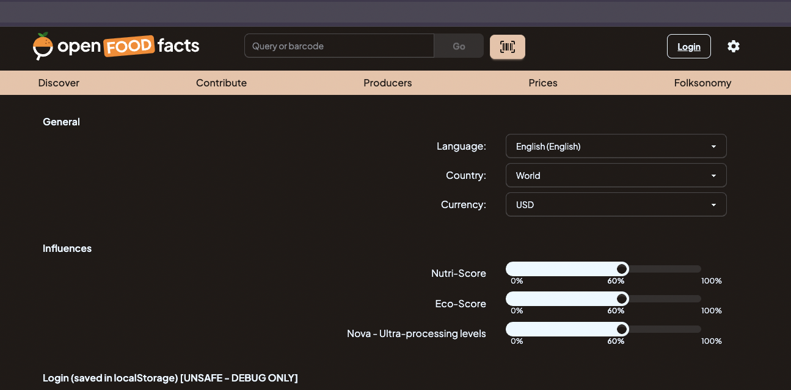
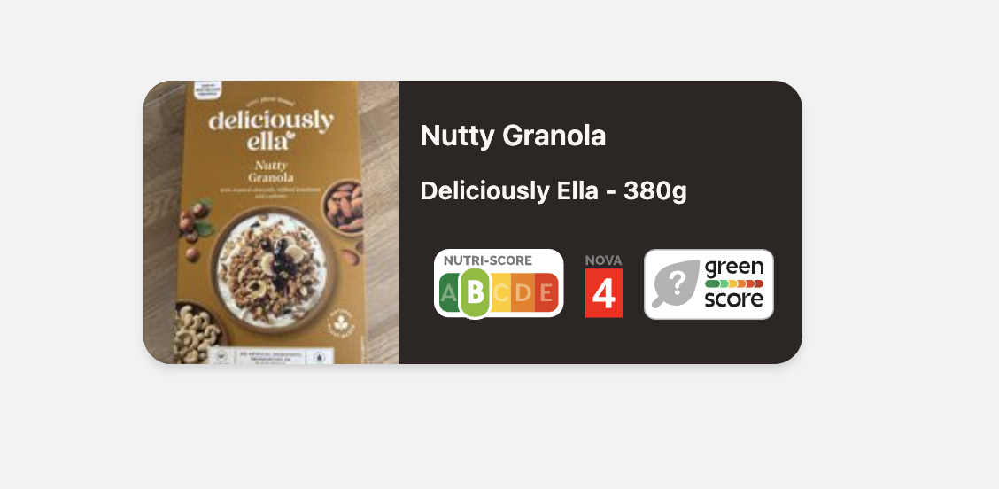
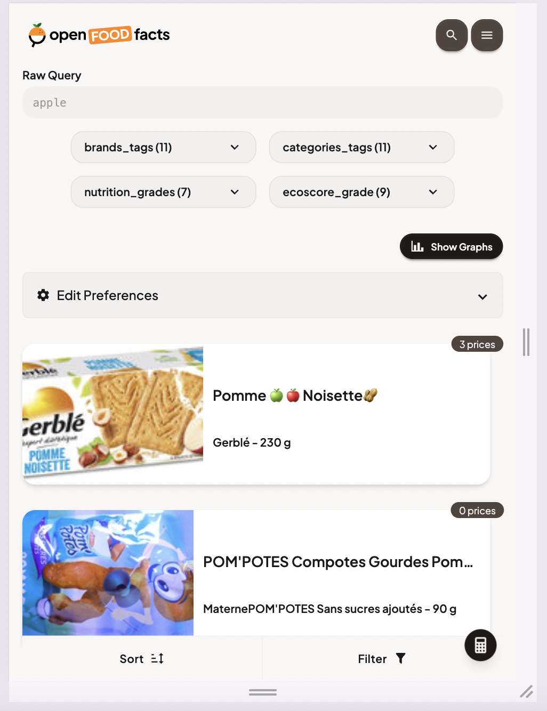
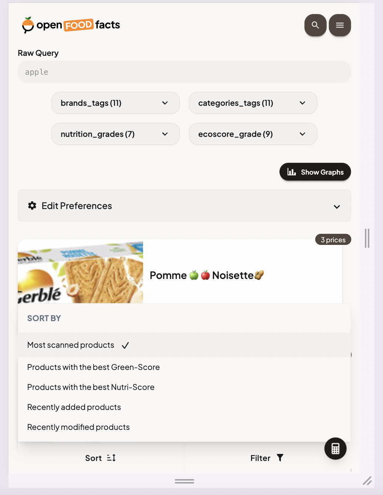
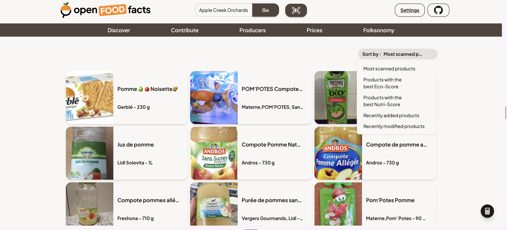
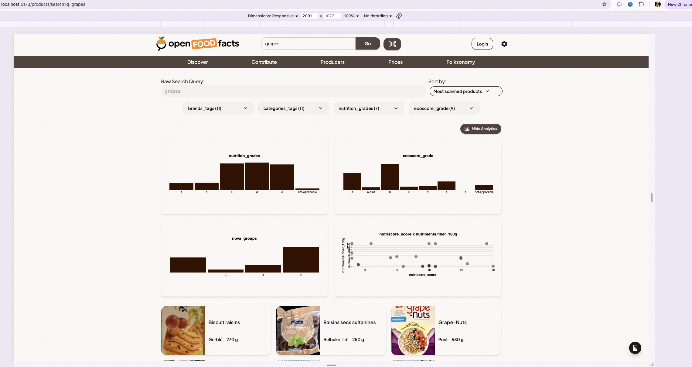
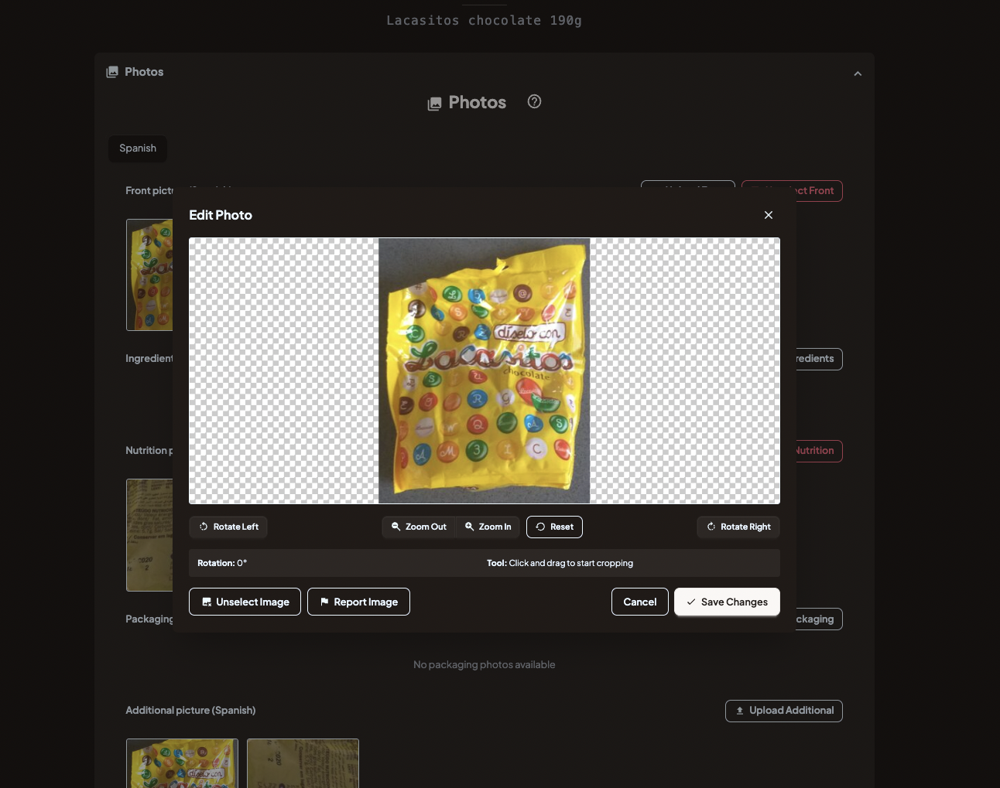

  

# Project: "[Open Food Facts Explorer - A New Generation Frontend](https://summerofcode.withgoogle.com/programs/2025/projects/3AaDmj04)"

| **Student**      | Mitali Singh                                                                                                                                   |
| :--------------- | :----------------------------------------------------------------------------------------------------------------------------------------------- |
| **Organisation** | [Open Food Facts](https://world.openfoodfacts.org/)                                                                                              |
| **GSoC Project**      | [Open Food Facts Explorer - A New Generation Frontend](https://summerofcode.withgoogle.com/programs/2025/projects/3AaDmj04) |
| **Mentors**        | [VaiTon](https://github.com/VaiTon), [Pierre Slamich](https://github.com/teolemon)                                                            |
| **GitHub**       | [heymitali](https://github.com/heymitali)                                                                                                     |
| **LinkedIn**     | [Mitali Singh](https://www.linkedin.com/in/heymitali/)                                                                                              |
| **Email**        | <a href="mailto:mitalisinghnaruka@gmail.com">mitalisinghnaruka@gmail.com</a>                                                                  |

# About Me
Hi, I’m Mitali, a Software Engineer with hands-on experience in various web technologies and frameworks. I’m passionate about creating scalable, high-performance applications and crafting intuitive user experiences that make a meaningful impact.

# Organization Overview

Open Food Facts is a global, non-profit initiative that maintains the world’s largest open database of food products. Often dubbed the “Wikipedia of food,” it’s powered by thousands of volunteers who collect and share detailed product data—including ingredients, nutrition, and environmental impact scores like Nutri-Score and Eco-Score.

# Project Description

Open Food Facts Explorer is the next-generation, experimental web front-end for the Open Food Facts database. Built with modern web technologies like SvelteKit, it's designed from the ground up to be fast, responsive, and mobile-first.

It is an open-source project that aims to eventually replace the current Perl-based website, offering a much-improved user experience and a more modern development stack. Explorer already had core functionalities such as product page rendering with Knowledge Panels, basic product editing and search capabilities, while integrating the folksonomy engine and taxonomy explorer to enhance data discoverability.

During Google Summer of Code 2025, I focused on advancing the Open Food Facts Explorer by delivering new features, improving design consistency, and strengthening backend API integration. My work aimed to make Explorer a more intuitive and powerful portal for contributors—enabling seamless food data exploration, contribution, and visualization. Key achievements include implementing secure authentication, advanced search, image editing, and enhancing the product addition flow to move closer to feature parity with the main website. I also contributed to reusable web components and the backend SDK, supporting a more modular and maintainable codebase.

## Key Objectives

- Achieve **feature parity** with the main website across product pages, search, and editing.
- **User authentication**: Build a complete Keycloak + PKCE login/logout flow with token handling and seamless session management.
- **Advanced Search Features**: Add autocomplete, faceted filters, sorting options, and interactive charts to improve exploration.
- **Personalization**: Introduce user preferences to tailor search results and experience.
- **Product Addition**: Added product addition feature in explorer and redesigned add/edit UI into step-by-step and section-based workflows.
- **Photo Editing**: Provide client-side photo editing functionality.
- **Web components**: Build and integrate reusable components such as product card, mobile badges, and donation banner.
- **Static pages**: Embed chromeless static pages using iFrame in explorer.
- **SDK and API integration**: Extend and consume the JavaScript SDK and align API usage toward full SDK adoption.

## Feature Work Delivered For Google Summer of Code 2025

### <b>Mobile Badges and Donation Banner Web Components Integration</b>
During Pre-GSoC period, I developed web components for the Mobile Badges and Donation Banner. During the GSoC coding phase, I enhanced these components with dark mode support and implemented various refinements. I have also integrated these components into the Explorer project.

  
  

<b>Relevant PRs:</b>
- https://github.com/openfoodfacts/openfoodfacts-explorer/pull/537
- https://github.com/openfoodfacts/openfoodfacts-explorer/pull/534
- https://github.com/openfoodfacts/openfoodfacts-webcomponents/pull/159
- https://github.com/openfoodfacts/openfoodfacts-webcomponents/pull/161
- https://github.com/openfoodfacts/openfoodfacts-webcomponents/pull/193
- https://github.com/openfoodfacts/openfoodfacts-webcomponents/pull/195
- https://github.com/openfoodfacts/openfoodfacts-webcomponents/pull/198

### <b>Integration of Static Pages</b>
I integrated the static pages into the Explorer by embedding their public URLs within iframes. In this work, I utilized the "content_only" parameter to display only the essential content. This approach enables a seamless, chromeless experience—removing unnecessary navigation elements and ensuring the static pages blend smoothly with the application's overall design.

  
  

<b>Relevant PRs:</b>
- https://github.com/openfoodfacts/openfoodfacts-explorer/pull/539
- https://github.com/openfoodfacts/openfoodfacts-explorer/pull/577
- https://github.com/openfoodfacts/openfoodfacts-web/pull/748

### <b>Implementation of Country Selection Option</b>
Added a user-friendly country selection feature within the application settings. This allows users to easily choose their preferred country, ensuring that product data and search results are tailored to their locale. The implementation focused on accessibility and seamless UI integration. In this work, I have added an API in JS SDK and later consumed it in explorer.

  

<b>Relevant PRs:</b>
- https://github.com/openfoodfacts/openfoodfacts-explorer/pull/589
- https://github.com/openfoodfacts/openfoodfacts-js/pull/653

### <b>Real Login Mechanism</b>
Implemented a secure authentication system using Keycloak with PKCE, enabling robust login and logout flows in the Explorer frontend. This ensures user credentials are protected and session management is handled seamlessly.

This was the most challenging and significant feature of my GSoC work. I gained hands-on experience with Keycloak, PKCE, and implementing a secure, end-to-end login flow. My contributions included adding Keycloak clients to the auth project and fully integrating authentication in Explorer—handling token persistence, secure redirects, and seamless user session management.

<video src="./assets/login.mov" height="350" controls autoplay muted></video>

<b>Relevant PRs:</b>
- https://github.com/openfoodfacts/openfoodfacts-explorer/pull/550
- https://github.com/openfoodfacts/openfoodfacts-auth/pull/203

### <b>Implemented and Integrated Product Card Web Component</b>
Designed and developed a reusable product card component in the web-components repository, featuring a modern, responsive UI to display product details. Seamlessly integrated this component into the Explorer frontend, enabling consistent product presentation and improving code modularity, maintainability, and user experience across the application.

  

<b>Relevant PRs:</b>
- https://github.com/openfoodfacts/openfoodfacts-webcomponents/pull/187
- https://github.com/openfoodfacts/openfoodfacts-explorer/pull/565

### <b>Autocomplete on Search</b>
Implemented an intuitive autocomplete feature to the search functionality. It provides real-time type-ahead suggestions as users enter their queries. This enhancement streamlines the search experience and helps users find products more efficiently.

<video src="./assets/autocomplete.mov" height="350" controls autoplay muted></video>

<b>Relevant PRs:</b>
- https://github.com/openfoodfacts/openfoodfacts-explorer/pull/556
- https://github.com/openfoodfacts/openfoodfacts-explorer/pull/560

### <b>Personalized Search</b>
Developed a user preferences feature that enables personalized search results tailored to individual user choices and dietary needs, enhancing the overall relevance and user experience of the Explorer.

<video src="./assets/user-pref.mov" height="450" controls autoplay muted></video>

<b>Relevant PRs:</b>
- https://github.com/openfoodfacts/openfoodfacts-explorer/pull/600
- https://github.com/openfoodfacts/openfoodfacts-webcomponents/pull/228
- https://github.com/openfoodfacts/openfoodfacts-webcomponents/pull/235
- https://github.com/openfoodfacts/openfoodfacts-js/pull/669

### <b>Sort Options on Search Results</b>
Added sorting options to the search results page, so users can easily reorder products by name, popularity, or nutrition. On mobile, sort and filter buttons are always accessible in a simple sticky footer for a smooth experience.

  

    
    
  

  

<b>Relevant PRs:</b>
- https://github.com/openfoodfacts/openfoodfacts-explorer/pull/559

### <b>Faceted Search</b>
Added faceted search functionality, allowing users to filter search results by multiple categories and attributes for more precise and efficient product discovery.

<video src="./assets/facets.mov" height="450" controls autoplay muted></video>

<b>Relevant PRs:</b>
- https://github.com/openfoodfacts/openfoodfacts-explorer/pull/563

### <b>Charts on Search Result Page</b>
Added interactive Vega charts to visualize search results, enabling users to easily explore and understand product data trends and distributions directly within the Explorer interface.

  

<b>Relevant PRs:</b>
- https://github.com/openfoodfacts/openfoodfacts-explorer/pull/594

### <b>Product Addition Feature</b>
Enabled users to add new products directly when a search returns no results, making it easier to contribute missing items to the database. Redesigned the product addition flow from a single page to a step-by-step guided form, and reworked the product editing UI from a single page to a section-based workflow. These changes created a more intuitive, efficient contribution experience and were among my most impactful contributions to the Explorer project.

<video src="./assets/add-product.mov" height="450" controls autoplay muted></video>
<video src="./assets/edit-product.mov" height="450" controls autoplay muted></video>

<b>Relevant PRs:</b>
- https://github.com/openfoodfacts/openfoodfacts-explorer/pull/579
- https://github.com/openfoodfacts/openfoodfacts-js/pull/660
- https://github.com/openfoodfacts/openfoodfacts-explorer/pull/700

### <b>Client Side Image Editing</b>
Introduced a client-side image editing feature using Cropper.js, allowing users to easily crop and adjust product images before uploading. Users can also edit images that have already been uploaded, as well as select and deselect images as needed. This enhancement streamlines the contribution process and improves the quality of submitted images.

  

<b>Relevant PRs:</b>
- https://github.com/openfoodfacts/openfoodfacts-explorer/pull/619
- https://github.com/openfoodfacts/openfoodfacts-js/pull/675

## Other Merged Pull requests

- https://github.com/openfoodfacts/openfoodfacts-explorer/pull/531
- https://github.com/openfoodfacts/openfoodfacts-explorer/pull/566
- https://github.com/openfoodfacts/openfoodfacts-explorer/pull/578
- https://github.com/openfoodfacts/openfoodfacts-explorer/pull/586
- https://github.com/openfoodfacts/openfoodfacts-explorer/pull/679
- https://github.com/openfoodfacts/openfoodfacts-explorer/pull/685
- https://github.com/openfoodfacts/openfoodfacts-explorer/pull/698
- https://github.com/openfoodfacts/openfoodfacts-webcomponents/pull/206
- https://github.com/openfoodfacts/openfoodfacts-webcomponents/pull/241

## Key Takeaways
- **Production-Ready Code:** I learned to write clean, maintainable code that’s optimized for real-world deployment—balancing readability, performance, and scalability.
- **Sustainable Development:** I focused on building solutions that are not just functional but future-proof and easy to extend.
- **Empathy in Engineering:** Designing with contributors in mind helped me appreciate the human side of open-source work.
- **Real-World Impact:** My contributions added lasting value to the Open Food Facts ecosystem, reinforcing the power of open data and community-driven development.
- **Technical Growth:** Learned Svelte and SvelteKit (server-side rendering–capable, lightweight), deepened understanding of authentication (Keycloak, PKCE), SDK design and integration, and type-safe API consumption.

## Listing all Contributions to Open Food Facts So Far

- [All PRs](https://github.com/pulls?q=is:pr+org:openfoodfacts+author:heymitali)

### Future Work:
“Every finish line is the start of a new race.” Completing GSoC was a significant milestone, but it also paved the way for new opportunities to enhance the Open Food Facts ecosystem. With the long-term vision of making Explorer the primary front-end, the following areas offer promising directions for future work:

- Integrate with upcoming projects such as Open Prices and Nutri-Patrol to expand Explorer’s capabilities and contributor engagement.
- Enhance the product addition and editing workflows for greater usability, validation, and contributor efficiency.
- Redesign and modernize key static pages (e.g., `/discover`, `/contribute`) to align with the new frontend framework and improve user experience.
- Transition all API interactions to the JavaScript SDK for consistency, maintainability, and future-proofing.
- Strengthen authentication and security by fully adopting Keycloak for user management and access control.
- Implement a product comparison feature to help users make informed choices and explore product differences easily.

# Special Thanks to Mentors and Community

- VaiTon [@Github](https://github.com/VaiTon)
- Pierre Slamich [@Github](https://github.com/teolemon)

I’m sincerely grateful to my mentors for their unwavering support, insightful feedback, and for believing in my potential throughout this journey. Their encouragement helped me grow not just as a developer, but as a confident contributor to open-source. I also want to thank the Open Food Facts community for creating such a welcoming and collaborative space—it made this experience incredibly enriching. GSoC has been a truly learningful journey, filled with challenges, growth, and meaningful connections. I look forward to staying actively involved in this community and continuing to contribute beyond the program.
