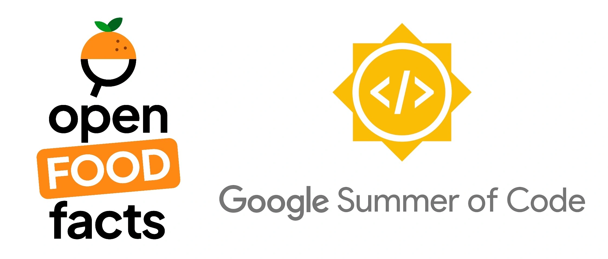

  

# Project: [Enhancing Developer Experience Through Automation and Workflow Optimization](https://summerofcode.withgoogle.com/programs/2025/projects/bCxnCqZt)

| **Student**      | Jagjeevan Anandrao Kashid                                                                                                                         |
| :--------------- | :-------------------------------------------------------------------------------------------------------------------------------------------------|
| **Organisation** | [Open Food Facts](https://world.openfoodfacts.org/)                                                                                               |
| **GSoC Project** | [Enhancing Developer Experience Through Automation and Workflow Optimization](https://summerofcode.withgoogle.com/programs/2025/projects/bCxnCqZt)|
| **Mentors**      | [Alex Garel](https://github.com/alexgarel), [Stéphane Gigandet](https://github.com/stephanegigandet), [Hangy](https://github.com/hangy)           |
| **GitHub**       | [Jagjeevanak](https://github.com/jagjeevanak)                                                                                                     |
| **LinkedIn**     | [Jagjeevan Kashid](https://www.linkedin.com/in/jagjeevankashid/)                                                                                  |
| **Email**        | <a href="mailto:jagjeevankashid97@gmail.com">jagjeevankashid97@gmail.com</a>                                                                      |

# About Me

Hi, I’m Kirtan, a Software Engineer from India. I love to build products and contribute to open-source.

# Organization Overview

Open Food Facts is a global, non-profit initiative that maintains the world's largest open database of food products. Often dubbed the "Wikipedia of food," it's powered by thousands of volunteers who collect and share detailed product data—including ingredients, nutrition, and environmental impact scores like Nutri-Score and Eco-Score.

# Project Description

Open Food Facts (OFF) relies on contributions from a global community of developers and volunteers. However, setting up development environments, navigating complex CI/CD pipelines, and contributing to multiple repositories like off-server, robotoff, and smooth-app can be time-consuming and frustrating—especially for newcomers. This project aims to streamline the entire contributor journey by creating a unified, cloud-powered Developer Experience (DevX) platform for OFF.

We will implement pre-configured Google IDX, Gitpod and Codespaces environments, enabling contributors to start coding within minutes. The CI/CD pipelines will be optimized to run only affected modules, significantly cutting build and test times. We'll also create a live, versioned documentation pipeline, integrate AI-powered tools for issue triage and PR review, and develop a metrics dashboard for maintainers to track workflow efficiency.

## Key Objectives

- Deployment staging environment with Docker swarm or Ansible.
- Auto-launch Gitpod/ Codespace environments.
- Optimized CI/CD workflows with modular test execution.
- Automated documentation site using OpenAPI Spec + MDX + Fumadocs.
- AI bot integration for issue triage.
- A real-time DevX dashboard.

This project will empower contributors to go from zero to green PRs faster, making OFF development more accessible, efficient, and scalable.
