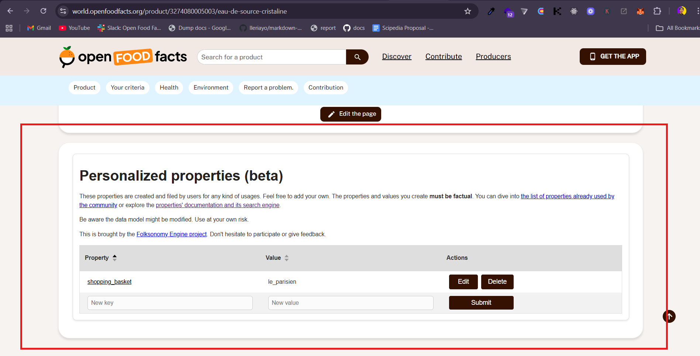
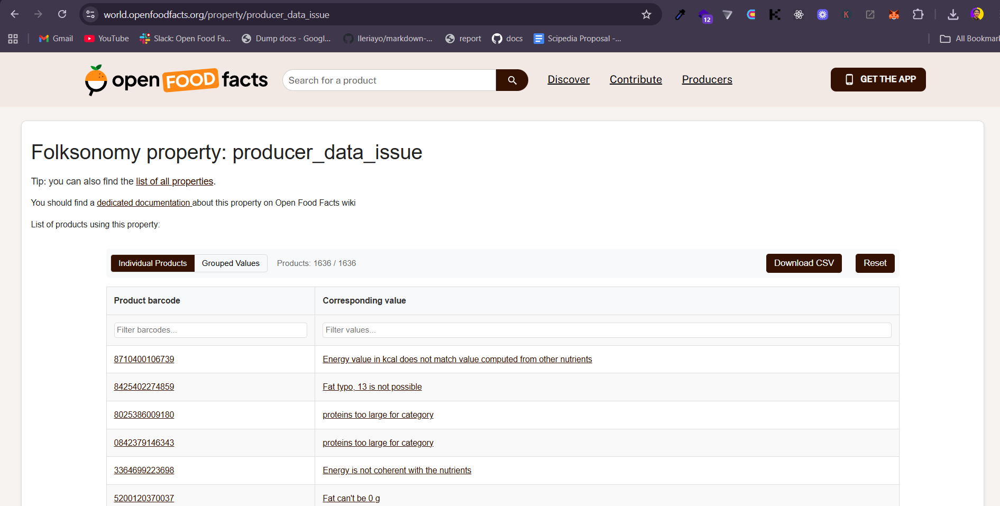
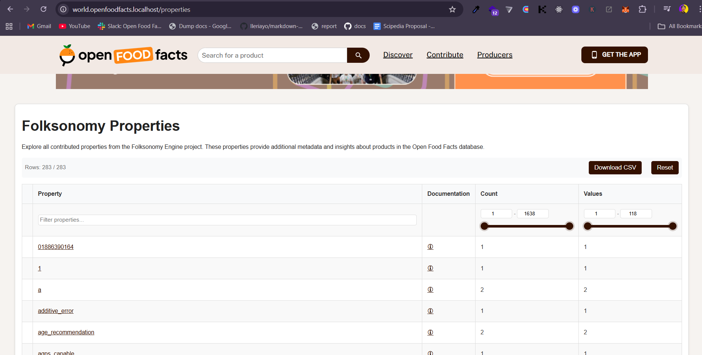
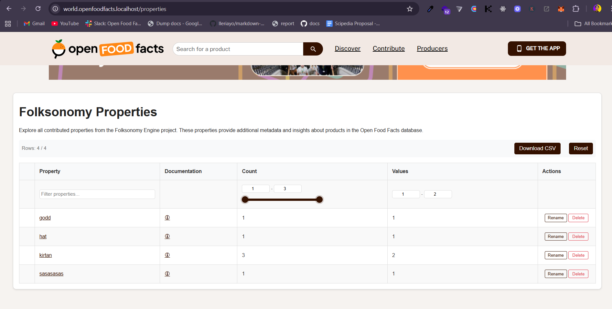
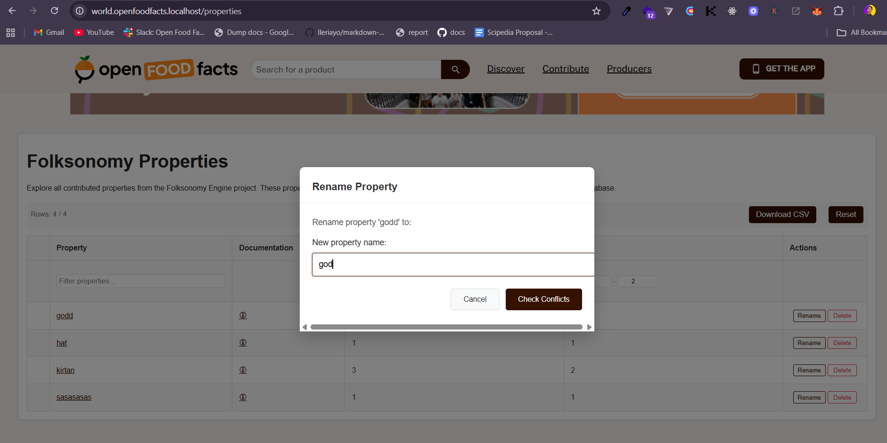
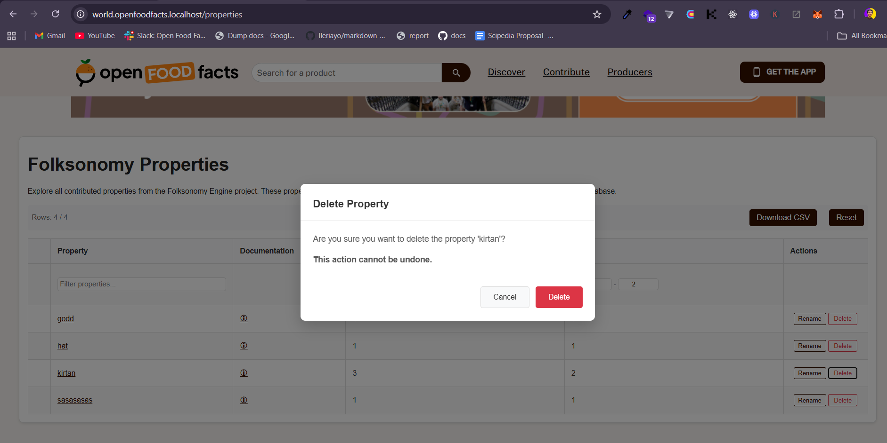

  

# Project: [Folksonomy Engine: a one size fit all for any product data](https://summerofcode.withgoogle.com/programs/2025/projects/AoicMwVR)

| **Student**      | Kirtan Manoj Chandak                                                                                                                          |
| :--------------- | :-------------------------------------------------------------------------------------------------------------------------------------------- |
| **Organisation** | [Open Food Facts](https://world.openfoodfacts.org/)                                                                                           |
| **GSoC Project** | [Folksonomy Engine: a one size fit all for any product data](https://summerofcode.withgoogle.com/programs/2025/projects/AoicMwVR)             |
| **Mentors**      | [Alex Garel](https://github.com/alexgarel), [Charles Nepote](https://github.com/CharlesNepote), [Pierre Slamich](https://github.com/teolemon) |
| **GitHub**       | [kirtanchandak](https://github.com/kirtanchandak)                                                                                             |
| **LinkedIn**     | [Kirtan Chandak](https://www.linkedin.com/in/kirtan-chandak/)                                                                                 |
| **Email**        | <a href="mailto:kirtanchandak@gmail.com">kirtanmchandak5@gmail.com</a>                                                                        |

# About Me

Hi, I’m Kirtan, a Software Engineer from India currently working with Kuration AI. I love to build products and contribute to open-source.

# Organization Overview

Open Food Facts is a global, non-profit initiative that maintains the world's largest open database of food products. Often dubbed the "Wikipedia of food," it's powered by thousands of volunteers who collect and share detailed product data—including ingredients, nutrition, and environmental impact scores like Nutri-Score and Eco-Score.

# Project Description

The Folksonomy Engine is a flexible system designed to handle any kind of product data for Open Food Facts. Just like how OpenStreetMap allows contributors to add any type of geographic information, the Folksonomy Engine enables users to add custom properties and values to products beyond the standard data fields.

At Open Food Facts, we collect data about food products, cosmetics, and various other products. However, modeling every possible product type and all their potential attributes is challenging. Different use cases require different data points - for example, researchers might want to know if cereals with cartoon characters on packaging contain more sugar.

The Folksonomy Engine addresses this by providing a crowdsourced approach to data collection. It allows contributors to define and add custom properties to products, making the database more comprehensive and useful for diverse research and consumer needs.

During Google Summer of Code 2025, I focused on enhancing the Folksonomy Engine to make it more accessible and efficient for a broader audience. My work involved developing new APIs, creating management tools for administrators, and developing exploration tools for contributors.

## Key Objectives

- **Web Components Integration**: Integrate existing web components from openfoodfacts-server and fix related bugs
- **Enhanced Suggestions**: Implement mobile-friendly suggestion systems using the folksonomy API
- **Property Management**: Create tools for managing properties and their values
- **User Role Management**: Develop systems for managing user roles within the folksonomy engine
- **Exploration Tools**: Build tools for exploring folksonomy properties and product properties
- **Content Moderation**: Implement bulk operations for fighting vandalism and managing data quality

## Pre GSOC -

#### **Allow Searching Keys**

Implemented the ability to search for keys within the folksonomy API, making it easier for users to find relevant properties quickly.

- **Issue:** https://github.com/openfoodfacts/folksonomy_api/issues/19
- **PR:** https://github.com/openfoodfacts/folksonomy_api/pull/263

#### **Add Data to Local Database**

Added support for inserting data directly into the local folksonomy database. This makes it easier for contributors to test changes and add sample data without affecting the production environment.

- **Slack Discussion:** https://openfoodfacts.slack.com/archives/C01M1T2E8L8/p1741101888486549
- **PR:** https://github.com/openfoodfacts/folksonomy_api/pull/252

#### **Enable Getting Multiple Properties at Once**

Enhanced the folksonomy API to allow fetching more than one property in a single request. This was done to optimize the performance, to encourage third party tools to use folksonomy engine as a database.

- **Issue:** https://github.com/openfoodfacts/folksonomy_api/issues/236
- **PR:** https://github.com/openfoodfacts/folksonomy_api/pull/244

#### **Add Typing for OpenAPI Response for `/keys`**

Improved the folksonomy API's OpenAPI documentation by adding proper typing for the `/keys` endpoint response.

- **Issue:** https://github.com/openfoodfacts/folksonomy_api/issues/149
- **PR:** https://github.com/openfoodfacts/folksonomy_api/pull/230

## Feature Work Delivered For Google Summer of Code 2025

### **Folksonomy Editor Integration**

Integrated the existing `folksonomy-editor` webcomponent from openfoodfacts-webcomponents into OpenFoodFacts. Unlike previous implementations, this integration now leverages the authentication token, making API requests more efficient. Implementing this was not trivial, as it required resolving new CORS issues that had not been encountered before in the API. The work also included ensuring compatibility, fixing integration bugs, and making sure the components work seamlessly within Open Food Facts. This integration enhances code reusability and maintains consistency across different Open Food Facts applications.

  

**Relevant PRs:**

- https://github.com/openfoodfacts/openfoodfacts-server/pull/12136

### **Mobile Suggestion System**

Implemented a comprehensive suggestion system that works effectively on mobile devices. The system uses the folksonomy API endpoints, particularly the `/values/{k}` endpoint.

Documentation - https://api.folksonomy.openfoodfacts.org/docs#/Keys%20%26%20Values/get_unique_values_values__k__get

**Relevant PRs:**

- https://github.com/openfoodfacts/folksonomy_api/pull/263

### **Property Generation Wizard**

Created a simple yet powerful property generation wizard that automatically creates corresponding wiki pages for new properties. This tool streamlines the process of adding new property types to the system and ensures proper documentation is maintained.

The wizard guides users through the process of defining new properties, validates the input, and automatically generates the necessary wiki documentation, making it easier for the community to understand and use new properties.

  <video width="700" controls>
    <source src="./assets/folksonomy-wizard.mp4" type="video/mp4">
    Your browser does not support the video tag.
  </video>

**Relevant PRs:**

- https://github.com/openfoodfacts/openfoodfacts-webcomponents/pull/200

### **User Role Management System**

Developed a comprehensive user role management system for the folksonomy engine. This allows us to restrict operations like bulk deletions or property modifications to trusted contributors.

The role management system includes different user levels with appropriate permissions - `user`, `moderator` and `admin` helping maintain data quality while allowing community participation.

Implemented API for checking user role `/user/me` on OpenFoodFacts -

Documentation:

- https://api.folksonomy.openfoodfacts.org/docs#/default/get_user_info_user_me_get

**Relevant PRs:**

- https://github.com/openfoodfacts/folksonomy_api/pull/295

### **Property Exploration Tools**

### WebComponents:

Built comprehensive exploration tools for both folksonomy properties and folksonomy product properties. These tools allow users to browse, search, and analyze the existing properties in the system, making it easier to understand what data is available and how it's being used.

The exploration tools include filtering capabilities, download CSV, and actions like delete, rename for moderators and admins.

**Relevant PRs:**

- https://github.com/openfoodfacts/openfoodfacts-webcomponents/pull/181
- https://github.com/openfoodfacts/openfoodfacts-webcomponents/pull/182

### Integration

Integrated these WebComponents into the Open Food Facts server, making the new tools available to all users.

#### Folksonomy Product Properties

  

#### Folksonomy Properties

  

**Relevant PRs:**

- https://github.com/openfoodfacts/openfoodfacts-server/pull/12148
- https://github.com/openfoodfacts/openfoodfacts-server/pull/12277

### **Bulk Property/Value Management APIs**

Implemented a robust bulk value management system designed to fight vandalism and maintain data quality. The system includes features for bulk removal, renaming, deletion, replacement, and clash detection of property values.

This tool is essential for maintaining the integrity of the folksonomy-engine, allowing administrators to quickly address data quality issues, remove spam or incorrect entries. The clash detection feature helps prevent conflicts when merging or modifying values.

Documentation:

- https://api.folksonomy.openfoodfacts.org/docs#/Admin%20-%20Property%20Management
- https://api.folksonomy.openfoodfacts.org/docs#/Admin%20-%20Value%20Management

**Relevant PRs:**

- https://github.com/openfoodfacts/folksonomy_api/pull/302

### **Bulk Property/Value Management UI**

Implemented UI for renaming, deleting and checking conflicts before deleting for values and properties.

  

  

  

**Relevant PRs:**

- https://github.com/openfoodfacts/openfoodfacts-webcomponents/pull/264

## Key Takeaways

- **API Integration**: Gained deep understanding of RESTful API design and integration, particularly in building suggestion systems that work efficiently across different devices
- **User Experience Focus**: Learned the importance of design and how to create tools that work well for both casual contributors and power users
- **Data Quality Management**: Understood the challenges of maintaining data quality in crowdsourced systems and developed tools to address these challenges

## Listing all Contributions to Open Food Facts So Far

- [All PRs](https://github.com/pulls?q=is:pr+org:openfoodfacts+author:kirtanchandak)

### Future Work:

The Folksonomy Engine has great potential for expansion and improvement. Future work could focus on:

- **Merge Values**: Find solutions related to merge values.
- **Property Generation**: Generate properties related to products specifically for Open Product Facts.
- **Nested Values Handling**: Figure out a way to handle nested values for different properties.
- **API Enhancements**: Expand the API with more advanced querying capabilities and better performance optimization

# Special Thanks to Mentors and Community

- [Alex Garel](https://github.com/alexgarel)
- [Charles Nepote](https://github.com/charlesnepote)
- [Pierre Slamich](https://github.com/teolemon)

I am deeply thankful to my mentors - Alex Garel, Charles Nepote, and Pierre Slamich for their support, guidance, and encouragement throughout my Google Summer of Code journey. I truly appreciate the time and effort they invested in mentoring me, and I feel incredibly fortunate to have had the opportunity to work with them. This project has been an exciting and transformative experience, and last but not least thanks to the Open Food Facts community for making it possible. I look forward to contributing to this amazing organization beyond GSOC.
